# MusicStore Website

## Table of Contents
1. [Introduction](#introduction)
2. [Technologies Used](#technologies-used)
3. [Features](#features)
4. [Installation](#installation)
5. [Usage](#usage)
6. [Screenshots](#screenshots)


## Introduction

MusicStore is an e-commerce platform where users can browse, purchase, and manage various music instruments. Admins can manage products, users, orders, and categories through a secure dashboard. This project was developed using React.js for the frontend, Django for the backend, Django Rest Framework (DRF) for API endpoints, and MySQL as the database.

## Technologies Used

- **Frontend**: React.js
- **Backend**: Django + Django Rest Framework (DRF)
- **Database**: MySQL
- **Authentication**: JWT (JSON Web Tokens) for secure user authentication

## Features

### User Features
- **Registration**: Users can create an account using an username, email and password.
- **Login**: Registered users can log in using JWT authentication.
- **Product Catalog**: Browse various music instruments available for purchase.
- **Add to Cart**: Users can add products to their cart for purchase.
- **Checkout**: Users can make payment to complete the orders.

### Admin Features
- **Product Management**: Admin can add, update, or delete products.
- **User Management**: Admin can add and delete users.
- **Order Management**: Admin can view and manage orders.
- **Dashboard**: Overview of the platform's statistics.
- **Category Management**: Admin can add, update, or delete product categories.

## Installation

To set up the MusicStore project locally, follow the steps below.

### Backend Setup (Django + DRF)
1. Clone the repository:
    ```bash
    git clone https://github.com/pathmanaban666/react-django-musicstore.git
    cd react-django-musicstore/Backend
    ```

2. Create and activate a virtual environment:
    ```bash
    python -m venv venv
    source venv/bin/activate  # For Linux/Mac
    venv\Scripts\activate     # For Windows
    ```

3. Install the required dependencies:
    ```bash
    pip install -r requirements.txt
    ```

4. Configure the Database and Application Credentials in the .env File:

   Navigate to .env file which is presented inside Backend Folder. Enter your mysql database and application credentials inside the .env file.

5. Run migrations:
    ```bash
    python manage.py makemigrations
    python manage.py migrate
    ```

6. Create a superuser:
    ```bash
    python manage.py createsuperuser
    ```

7. Start the backend server:
    ```bash
    python manage.py runserver
    ```

### Frontend Setup (React.js)
1. Navigate to the frontend directory:
    ```bash
    cd react-django-musicstore/Frontend
    ```

2. Install the required dependencies:
    ```bash
    npm install
    ```

3. Create a .env file inside the Frontend Folder and add the following environment variable:
   ```bash
   REACT_APP_API_BASE_URL=http://localhost:8000/
   ```

4. Run the frontend development server:
    ```bash
    npm start
    ```

Now, your backend should be running at `http://localhost:8000` and frontend at `http://localhost:3000`.

## Usage

1. **User Registration**: Go to the "Register" page, enter your details, and click on "Sign Up."
2. **Login**: After registration, you can log in to your account.
3. **Browse Products**: View the available products on the home page.
4. **Add to Cart**: Click on "Add to Cart" on a product page to add it to your shopping cart.
5. **Checkout**: Complete your purchase by entering the shipping and payment credentials.

### Admin Panel
- **Login**: Go to `http://localhost:8000/admin/login` and log in using the admin credentials you created.
- **Manage Products, Users, and Orders**: Use the dashboard to manage the application.

## Screenshots

### Home Page
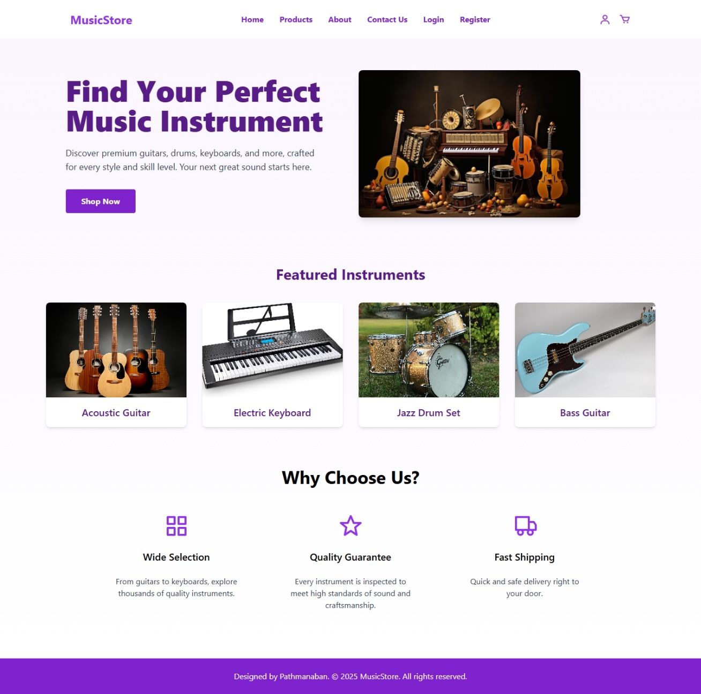

### Register Page
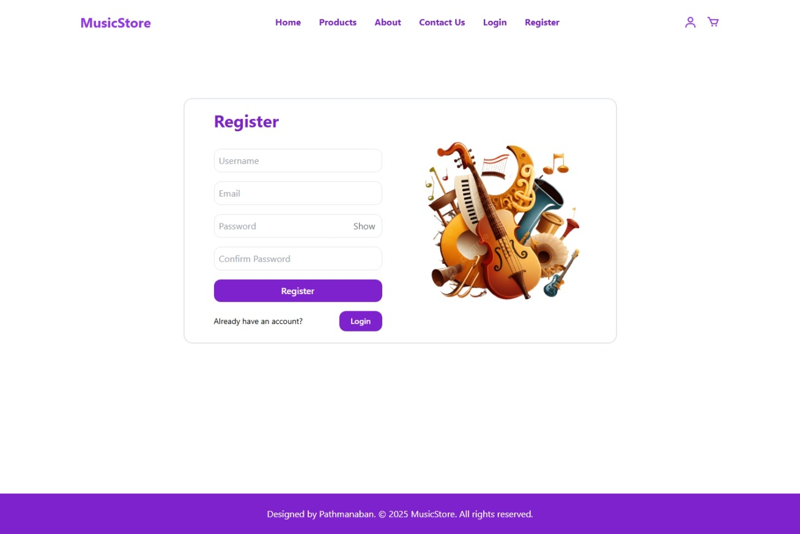

### Login Page
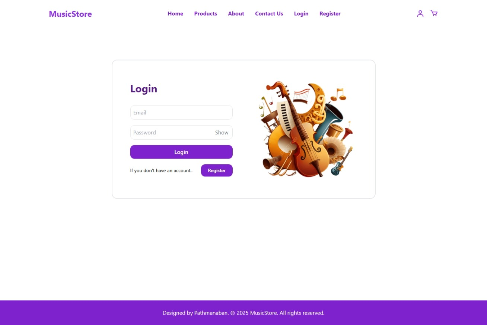

### Product Listing Page
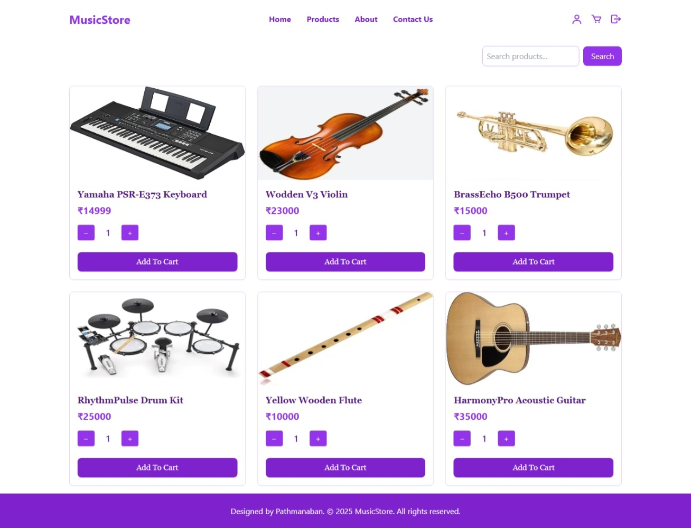

### Product View Page
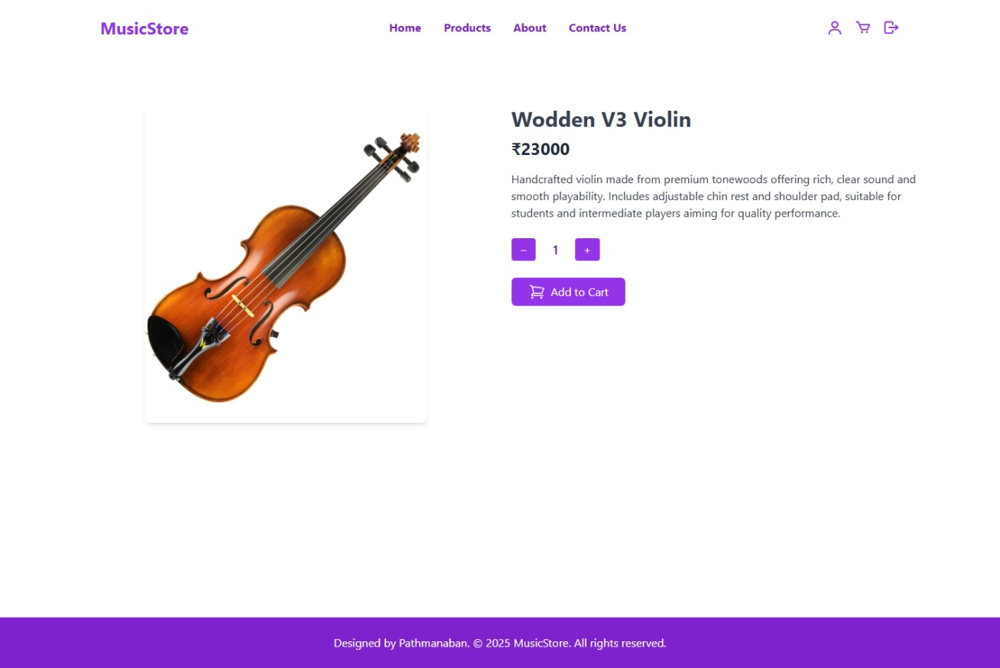

### Cart Page
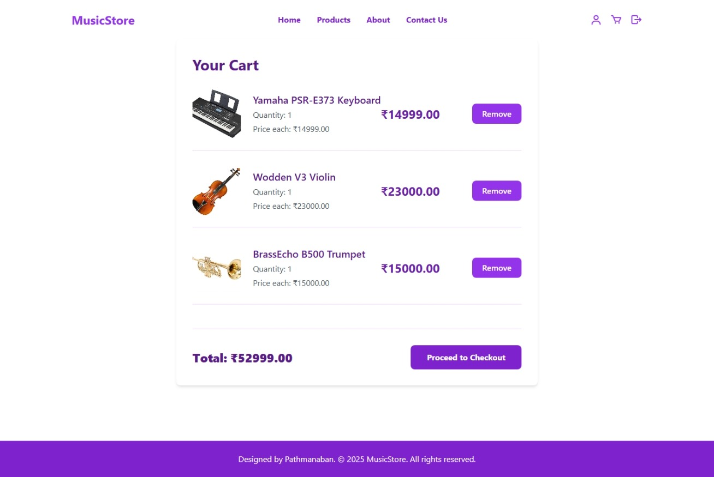

### Checkout Page
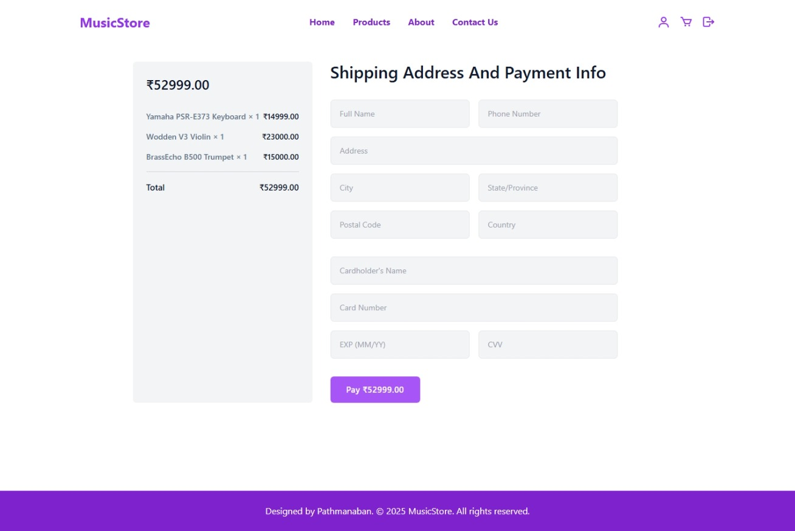

### Payment Success Page
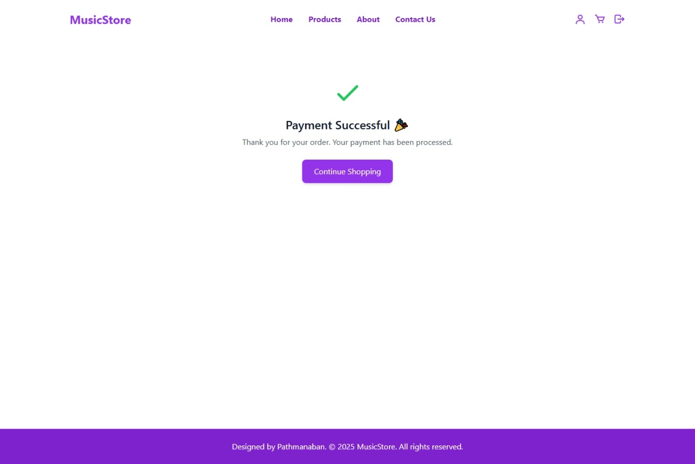

### About Page
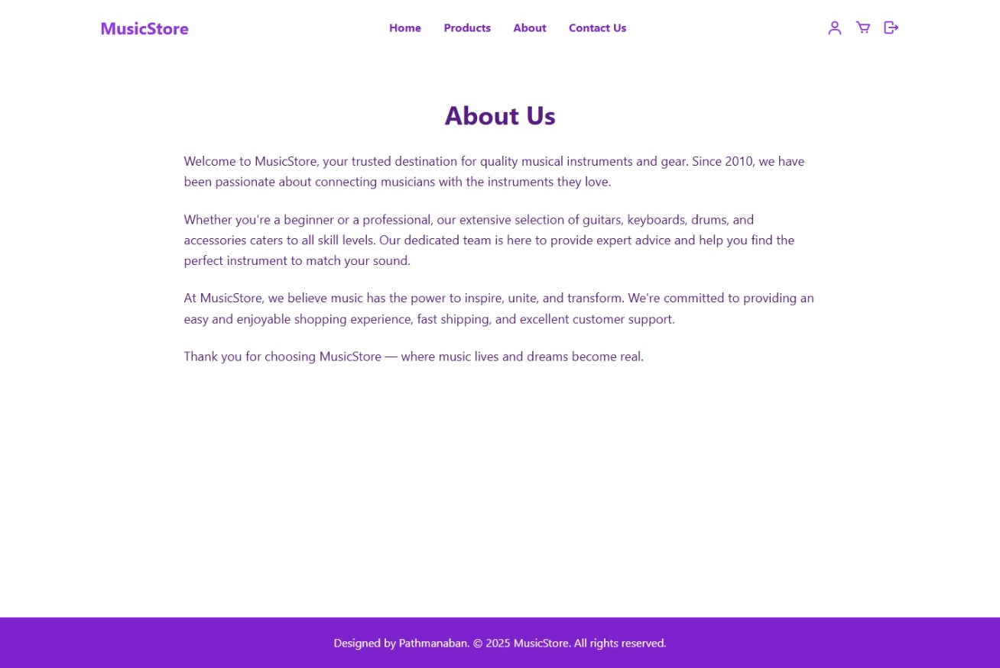

### Contact Page
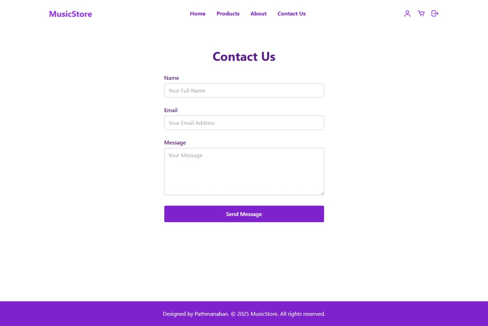

### Admin Dashboard Page
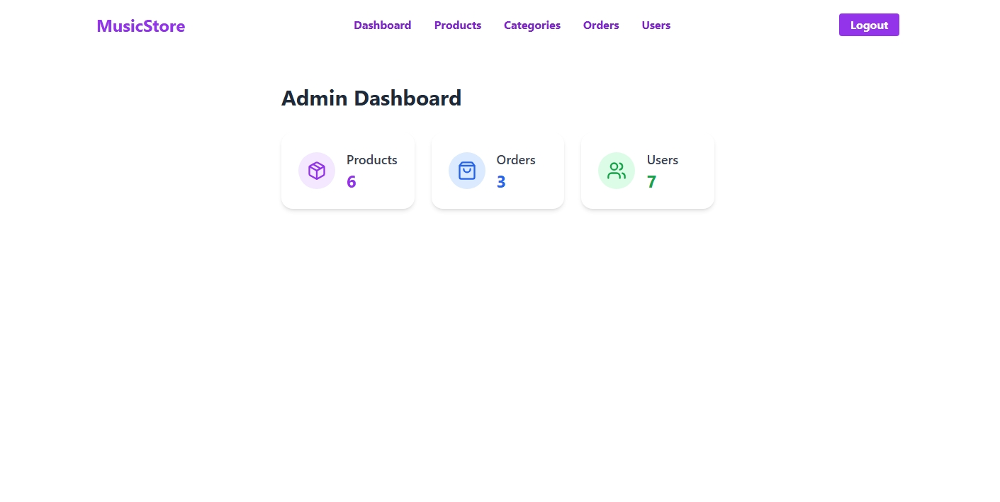

### Admin Products Page
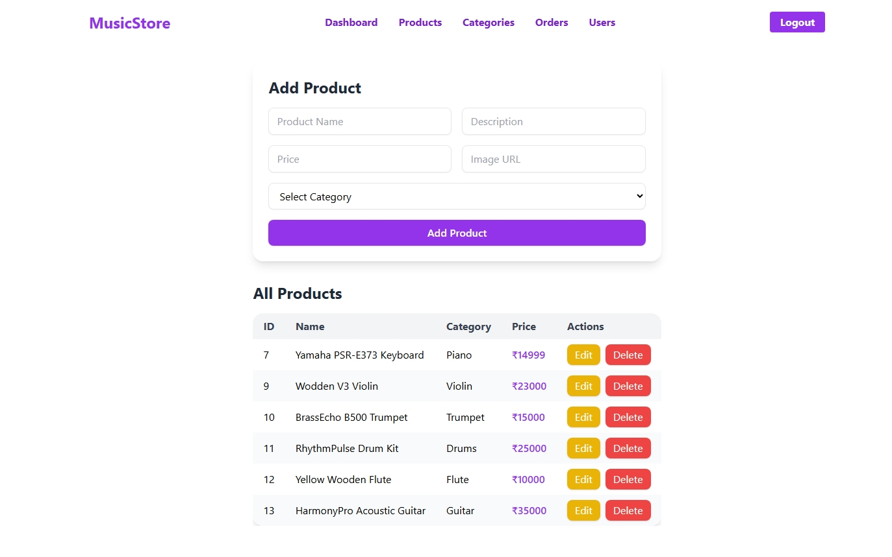

### Admin Product Orders Page
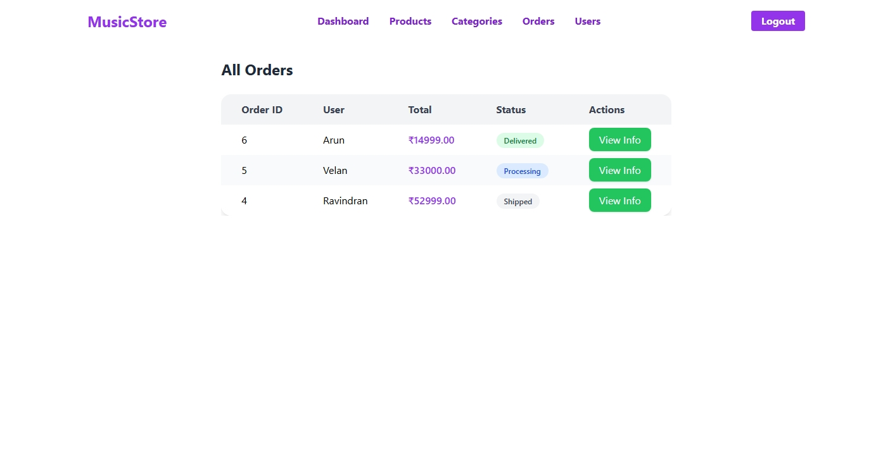

### Admin Product Order View Page
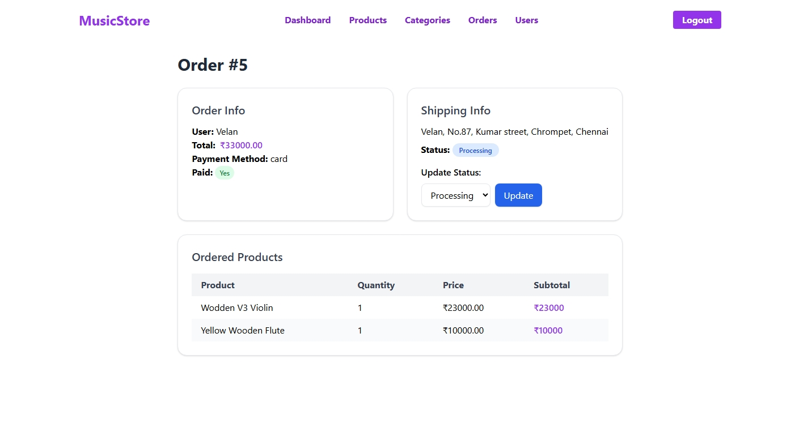

### Admin Product Categories Page
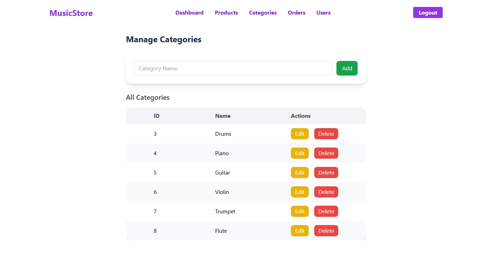

### Admin Users Page
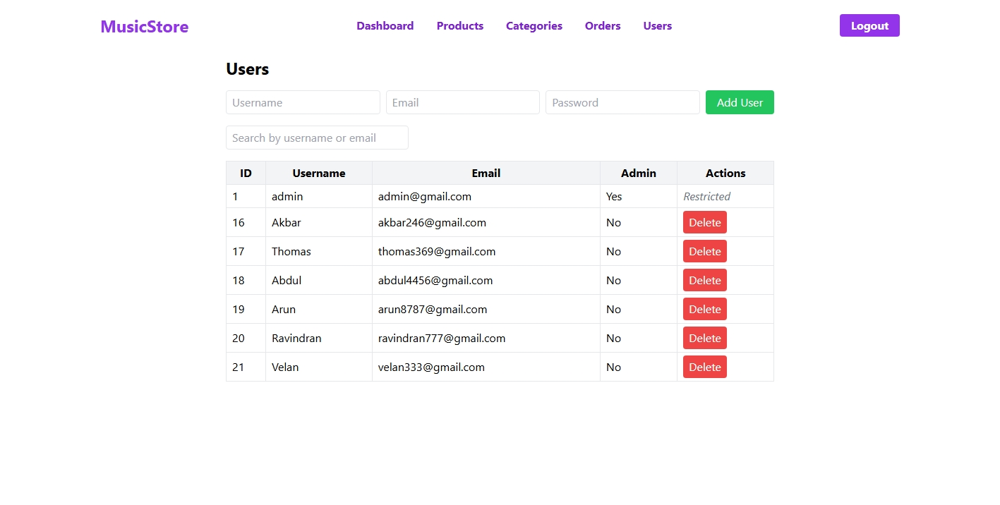